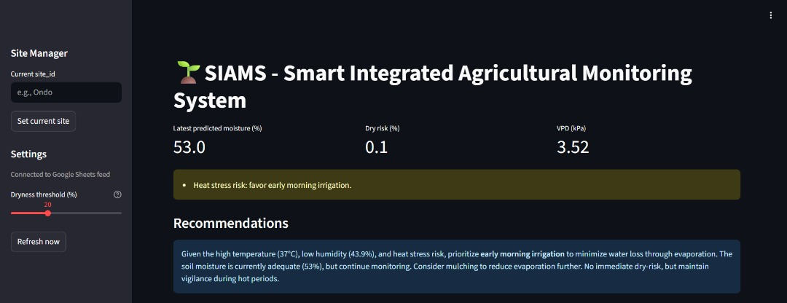
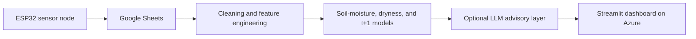

# SIAMS: Smart Integrated Agricultural Monitoring System

A low-cost IoT and machine-learning platform for irrigation decision support on Nigerian smallholdings.

An ESP32 sensor node streams soil moisture, air temperature, humidity, and light readings to Google Sheets. A Python pipeline cleans the data and engineers features, gradient-boosting models estimate soil moisture and dryness, and an optional LLM layer turns the outputs into plain-language irrigation recommendations with a stated rationale. Everything is surfaced through a Streamlit dashboard hosted on Microsoft Azure.

This repository accompanies:

> J. Ajayi and A. Okandeji, "Smart Integrated Agricultural Monitoring System (SIAMS): A Low-Cost IoT and Machine-Learning Platform for Irrigation Decision Support in Nigeria," accepted at IEEE NIGERCON 2026, Lagos, Nigeria, Nov. 2026. To appear in IEEE Xplore.

Undergraduate thesis (OSF preprint): https://osf.io/preprints/thesiscommons/bmvxz_v1

Live dashboard: https://siamswebapp-bwhgaydve6ccbuf0.eastus-01.azurewebsites.net



## What it does

- Reads sensor data from a Google Sheet that the ESP32 node writes to.
- Cleans readings, adds calendar, lag, and rolling features, and computes plant-health indicators (VPD, dew point, heat, frost, waterlogging and dry-spell flags, a rule-based disease-risk score, and a stuck-sensor flag).
- Estimates soil moisture, the probability that a plot is dry (default threshold 20%), and a one-step-ahead (t+1) soil-moisture value.
- Optionally generates irrigation recommendations through an LLM (OpenAI, Gemini, or a Hugging Face model; disabled by default).
- Shows KPIs, alerts, trends, and raw data per site, with CSV export.

## Data

The models were trained on 3,129 readings from four sites. Each site was a short, single-session deployment of roughly two to three hours.

| Site | Readings | Date |
| --- | --- | --- |
| Ogun | 913 | 25 May 2025 |
| Osun | 761 | 9 Jun 2025 |
| Ikorodu | 626 | 2 Aug 2025 |
| UNILAG (Lagos) | 829 | 6 Sep 2025 |

Cleaned data, engineered features, and per-site summaries are in `notebook/`.

## Results, read carefully

Soil-moisture regression, from `notebook/siams_model_results.csv`:

| Model | RMSE | MAE | R² |
| --- | --- | --- | --- |
| Gradient Boosting | 0.72 | 0.50 | 0.998 |
| XGBoost | 1.37 | 0.96 | 0.992 |
| Decision Tree | 1.68 | 1.28 | 0.988 |
| Random Forest | 1.75 | 1.05 | 0.987 |

These scores look strong, but they mostly reflect autocorrelation. Within a two-to-three-hour session, soil moisture barely changes from one reading to the next, and the models receive lagged soil moisture as input.

The paper tests this directly. Under a time-based evaluation, a persistence baseline that simply repeats the previous reading matches or beats the models at horizons from ten seconds to ten minutes. With deployments this short, the forecasting models add little over persistence.

The contribution of SIAMS is therefore the deployable, low-cost, end-to-end platform and its explainable recommendation layer, not forecasting accuracy. The persistence-baseline comparison is reported in the paper; the notebook here covers data preparation, feature engineering, and model training.

## Architecture


```mermaid
flowchart LR
    A[ESP32 sensor node] --> B[Google Sheets]
    B --> C[Cleaning and feature engineering]
    C --> D[Soil-moisture, dryness, and t+1 models]
    D --> E[Optional LLM advisory layer]
    E --> F[Streamlit dashboard on Azure]
```

## Repository layout

```
SIAMS_Web/
├── app/
│   ├── streamlit_app.py      # Dashboard and inference
│   ├── siams_prep.py         # Cleaning, feature engineering, health metrics
│   └── pull_raw_debug.py     # Helper for inspecting raw sheet data
├── hardware/
│   └── SIAMS_V2.ino          # ESP32 firmware
├── models/                   # Trained models and feature/metadata files
├── notebook/
│   ├── SIAMS_ML_Pipeline.ipynb
│   ├── plots/                # EDA, feature importance, predicted vs. actual
│   └── *.csv                 # Cleaned data, features, results, site summary
├── docs/screenshots/
├── test_column_mapping.py    # Column-mapping check for the prep pipeline
├── requirements.txt
└── .github/workflows/        # Azure App Service deployment
```

## Hardware

`hardware/SIAMS_V2.ino` runs on an ESP32 with a DHT11 (air temperature and humidity), an analog soil-moisture probe, and an analog light sensor, and logs readings to Google Sheets. It is adapted from the Random Nerd Tutorials ESP32 Google Sheets data-logging example and the ESP-Google-Sheet-Client library.

Before flashing, fill in your Wi-Fi details, Google Cloud project ID, service-account email and private key, and spreadsheet ID.

## Running locally

Requires Python 3.11 or newer.

```bash
git clone https://github.com/HayJay71/SIAMS_Web.git
cd SIAMS_Web
python -m venv venv
source venv/bin/activate        # Windows: venv\Scripts\activate
pip install -r requirements.txt
```

Create `app/.env` (it is git-ignored, as is `secrets/`):

```bash
# Data source
SHEETS_CSV_URL=https://docs.google.com/spreadsheets/d/YOUR_SHEET_ID/export?format=csv
SHEET_ID=YOUR_SHEET_ID
TZ=Africa/Lagos

# Models
MODEL_PATH=../models/model.joblib
FEATURES_JSON=../models/expected_features.json
DRYNESS_CLF=../models/dryness_clf.joblib
T1_MODEL=../models/model_t1.joblib
T1_FEATURES_JSON=../models/expected_features_t1.json

# Sites and thresholds
KNOWN_SITES=Ikorodu,Ogun,Osun,Unilag
DRY_THRESHOLD=20
CACHE_TTL_SECONDS=60

# LLM recommendations (none | openai | gemini | hf)
LLM_PROVIDER=none
OPENAI_API_KEY=
GEMINI_API_KEY=
GEMINI_MODEL=gemini-1.5-flash

# Google service account (path, or base64-encoded JSON)
GOOGLE_SA_JSON=../secrets/your-service-account.json
GOOGLE_SA_JSON_B64=
```

Then run:

```bash
cd app
streamlit run streamlit_app.py
```

To retrain the models, run `notebook/SIAMS_ML_Pipeline.ipynb` from top to bottom.

## Deployment

Pushes to `master` build and deploy the app to Azure App Service through the GitHub Actions workflow in `.github/workflows/`. On Azure, the variables above are set as App Settings rather than in a file.

## Limitations

- Each site was observed for a single short session, so the data has no day-night, weekly, or seasonal coverage.
- The DHT11 has limited accuracy and resolution.
- The LLM recommendations were assessed by expert review in the paper, not yet through farmer field trials.
- Longer, multi-season deployments are needed before the predictive models can be judged on their own merit.

## Citation

```bibtex
@inproceedings{ajayi2026siams,
  author    = {Joshua Ajayi and Alexander Okandeji},
  title     = {Smart Integrated Agricultural Monitoring System (SIAMS): A Low-Cost IoT and Machine-Learning Platform for Irrigation Decision Support in Nigeria},
  booktitle = {IEEE NIGERCON 2026},
  address   = {Lagos, Nigeria},
  year      = {2026},
  note      = {Accepted, to appear}
}
```

## Acknowledgements

Supervised by Dr. Alexander Okandeji, Department of Electrical and Electronics Engineering, University of Lagos. Firmware adapted from Random Nerd Tutorials and the ESP-Google-Sheet-Client library.

## License

MIT. See `LICENSE`.

Contact: Joshua Ajayi, joshayotundeaj@gmail.com
