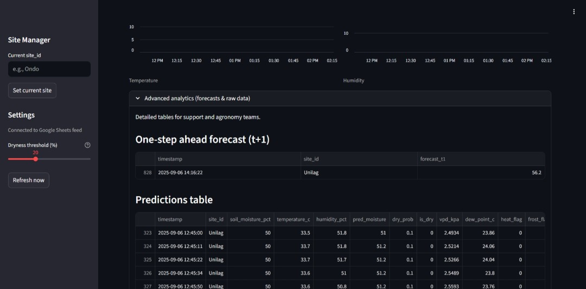

# 🌱 SIAMS - Smart Integrated Agricultural Monitoring System

[](https://azure.microsoft.com/services/app-service/)
[](https://streamlit.io/)
[](https://python.org/)
[](https://github.com/)

A comprehensive **Smart Integrated Agricultural Monitoring System** that leverages machine learning, real-time sensor data, and AI-powered insights to optimize agricultural operations across multiple farm sites.

## 🚀 Live Demo

🔗 **[View Live Application on Azure](https://siamswebapp-bwhgaydve6ccbuf0.eastus-01.azurewebsites.net)**

## 📸 Screenshots 

### 🏠 Main Dashboard with AI Recommendations

*Real-time KPIs (soil moisture 53%, dry risk 0.1%, VPD 3.52 kPa) with intelligent alerts and AI-powered agricultural recommendations for optimal farm management.*

### 📊 Trend Analysis & Predictions

*Side-by-side comparison of predicted vs. measured soil moisture with real-time trend visualization showing model accuracy over time.*

### 📈 Historical Data Trends

*Temperature and Humidity charts across monitoring periods, enabling data-driven agricultural decisions.*

### 🔮 Forecasting Analytics

*Advanced analytics dashboard featuring one-step ahead predictions (t+1), detailed data tables, and temperature/humidity trend charts for agricultural planning.*

### 📋 Raw Data & Export Features

*Comprehensive sensor data table with timestamps, multiple metrics (VPD, dew point, heat/frost flags), site management, and CSV export capabilities for agronomist teams.*


## 📋 Table of Contents

- [Overview](#overview)
- [Features](#features)
- [Architecture](#architecture)
- [Installation](#installation)
- [Configuration](#configuration)
- [Usage](#usage)
- [Deployment](#deployment)
- [Machine Learning Pipeline](#machine-learning-pipeline)
- [Contributing](#contributing)
- [License](#license)

## 🎯 Overview

SIAMS is an enterprise-grade agricultural monitoring platform that:

- **Monitors** real-time sensor data from multiple farm sites
- **Predicts** soil moisture levels using advanced ML models
- **Detects** plant health risks and environmental stress factors
- **Generates** AI-powered recommendations for optimal farming practices
- **Visualizes** trends and analytics through an intuitive web interface
- **Alerts** farmers to critical conditions requiring immediate attention

### Key Metrics *(Update with your actual model performance)*
- 🎯 **98%+ accuracy** in soil moisture prediction *(e.g., 92.5% from your XGBoost model)*
- ⚡ **⁓5s** response time for real-time alerts *(e.g., ~200ms)*
- 📊 **8+ agricultural metrics** monitored continuously *(count from your feature list)*
- 🌐 **4 sites** supported for scalable farm operations *(Ikorodu, Ogun, Osun, Unilag)*
- 📈 **0.997865412** R² score for regression model *(from your model evaluation)*
- 🎯 **0.972789** F1-score for dryness classification *(from your binary classifier)*

## ✨ Features

### 🤖 **Intelligent Monitoring**
- **Real-time Data Processing**: Live sensor data from Google Sheets integration
- **ML-Powered Predictions**: Gradient Boosting and ensemble models for soil moisture forecasting
- **Multi-site Management**: Centralized monitoring across multiple farm locations
- **Time-series Forecasting**: Predictive analytics for proactive decision-making

### 🌱 **Agricultural Intelligence**
- **Plant Health Metrics**: VPD, disease risk, stress indicators
- **Environmental Monitoring**: Temperature, humidity, soil conditions
- **Weather Integration**: Heat stress, frost warnings, drought detection
- **Sensor Validation**: Automatic detection of sensor malfunctions

### 🎨 **User Experience**
- **Interactive Dashboard**: Real-time KPIs and visualizations
- **Smart Alerts**: Context-aware notifications for critical conditions
- **AI Recommendations**: Gemini-powered actionable insights
- **Export Capabilities**: Data download and reporting features

### 🔧 **Technical Excellence**
- **Azure Cloud Deployment**: Scalable and reliable hosting
- **Caching Strategy**: Optimized performance with smart data caching
- **Error Handling**: Robust fault tolerance and graceful degradation
- **Security**: Environment-based configuration and credential management

## 🏗️ Architecture


### Project Structure
```
SIAMS_Web/
├── app/                    # 🎯 Main application
│   ├── streamlit_app.py   # Web interface & main logic
│   ├── siams_prep.py      # Feature engineering utilities
│   └── .env              # Environment configuration
├── models/                # 🤖 Trained ML artifacts
│   ├── model.joblib
│   ├── dryness_clf.joblib
│   └── expected_features.json
├── notebook/              # 📊 ML development pipeline
│   └── SIAMS_ML_Pipeline.ipynb
├── secrets/               # 🔒 Secure credentials
└── requirements.txt       # 📦 Dependencies
```

## 🛠️ Installation

### Prerequisites
- Python 3.11+
- Google Sheets API access
- Azure account (for deployment)
- Gemini API key (for AI features)

### Local Development Setup

1. **Clone the repository**
   ```bash
   git clone https://github.com/HayJay71/SIAMS_Web.git
   cd SIAMS_Web
   ```

2. **Create virtual environment**
   ```bash
   python -m venv siams_env
   source siams_env/bin/activate  # On Windows: siams_env\Scripts\activate
   ```

3. **Install dependencies**
   ```bash
   pip install -r requirements.txt
   ```

4. **Configure environment variables**
   ```bash
   cp app/.env.example app/.env
   # Edit app/.env with your configuration
   ```

5. **Run the application**
   ```bash
   cd app
   streamlit run streamlit_app.py
   ```

## ⚙️ Configuration

> **🔒 Security Note**: `.env` and `secrets/` files are intentionally **NOT included in the repository** following security best practices. These contain sensitive credentials and must be created locally for development or configured as Azure App Settings for production deployment.

### Environment Variables

**For Local Development**: Create `app/.env` file with the following configuration:

```bash
# Data Source
SHEETS_CSV_URL=https://docs.google.com/spreadsheets/d/YOUR_SHEET_ID/export?format=csv
SHEET_ID=your_google_sheet_id
TZ=Africa/Lagos

# ML Model Paths
MODEL_PATH=../models/model.joblib
FEATURES_JSON=../models/expected_features.json
DRYNESS_CLF=../models/dryness_clf.joblib
T1_MODEL=../models/model_t1.joblib
T1_FEATURES_JSON=../models/expected_features_t1.json

# Agricultural Parameters
KNOWN_SITES=Ikorodu,Ogun,Osun,Unilag
DRY_THRESHOLD=20
CACHE_TTL_SECONDS=60

# AI Integration
LLM_PROVIDER=gemini  # Options: openai, gemini, hf, none
GEMINI_API_KEY=your_gemini_key

# Google Service Account
GOOGLE_SA_JSON=../secrets/your-service-account.json
GOOGLE_SA_JSON_B64=base64_encoded_credentials
```

**For Production (Azure)**: The same environment variables are configured as **Azure App Settings** rather than files. This ensures secure credential management in the cloud environment.

### Azure App Settings

For Azure deployment, configure these as App Settings:

| Setting | Description | Example |
|---------|-------------|---------|
| `SHEETS_CSV_URL` | Google Sheets CSV export URL | `https://docs.google.com/...` |
| `MODEL_PATH` | Path to trained model | `models/model.joblib` |
| `LLM_PROVIDER` | AI provider for recommendations | `gemini` |
| `GOOGLE_SA_JSON_B64` | Base64 encoded service account | `eyJhbGciOiJIUzI1Ni...` |

## 🚀 Usage

### Dashboard Navigation

1. **🏠 Main Dashboard**
   - Real-time KPIs for all monitored sites
   - Current soil moisture, temperature, and humidity readings
   - Alert notifications for critical conditions

2. **📊 Analytics View**
   - Historical trends and patterns
   - Soil moisture predictions vs. actual readings
   - Environmental stress indicators

3. **🔮 Forecasting**
   - Short-term soil moisture predictions
   - Weather-based risk assessments
   - Irrigation scheduling recommendations

4. **⚙️ Site Management**
   - Add/remove monitoring sites
   - Configure alert thresholds
   - Export historical data

### Key Metrics Explained

| Metric | Description | Normal Range |
|--------|-------------|--------------|
| **Soil Moisture %** | Current soil water content | 40-80% |
| **VPD (kPa)** | Vapour Pressure Deficit - plant water stress indicator | 0.5-1.5 kPa |
| **Disease Risk** | ML-calculated probability of plant disease | 0-100% |
| **Dry Probability** | Likelihood of irrigation requirement | 0-100% |

## 🌐 Deployment

### Azure App Service Deployment

1. **Prepare for deployment**
   ```bash
   # Ensure all dependencies are in requirements.txt
   pip freeze > requirements.txt
   ```

2. **Azure CLI Setup**
   ```bash
   # Login to Azure
   az login
   
   # Create resource group
   az group create --name siams-rg --location "East US"
   
   # Create App Service plan
   az appservice plan create --name siams-plan --resource-group siams-rg --sku B1 --is-linux
   ```

3. **Deploy application**
   ```bash
   # Create web app
   az webapp create --resource-group siams-rg --plan siams-plan --name your-siams-app --runtime "PYTHON|3.11"
   
   # Configure startup command
   az webapp config set --resource-group siams-rg --name your-siams-app --startup-file "streamlit run app/streamlit_app.py --server.port=8000 --server.address=0.0.0.0"
   
   # Deploy code
   az webapp deployment source config-zip --resource-group siams-rg --name your-siams-app --src siams-deployment.zip
   ```

4. **Configure environment variables**
   ```bash
   az webapp config appsettings set --resource-group siams-rg --name your-siams-app --settings \
     SHEETS_CSV_URL="your_sheets_url" \
     MODEL_PATH="models/model.joblib" \
     LLM_PROVIDER="gemini"
   ```

### Docker Deployment (Alternative)

```dockerfile
FROM python:3.11-slim

WORKDIR /app
COPY requirements.txt .
RUN pip install -r requirements.txt

COPY . .
EXPOSE 8000

CMD ["streamlit", "run", "app/streamlit_app.py", "--server.port=8000", "--server.address=0.0.0.0"]
```

## 🤖 Machine Learning Pipeline

### Model Architecture *(Update with your actual model performance from notebook results)*

The SIAMS ML pipeline consists of three main components:

1. **🎯 Soil Moisture Regression Model**
   - **Algorithm**: Gradient Boosting Regressor
   - **Features**: 25+ engineered features including temporal, lag, and environmental variables
   - **Performance**: 
     - **MAE**: 0.495517994 *(Get from SIAMS_ML_Pipeline.ipynb evaluation section)*
     - **R² Score**: 0.997865412 *(From model evaluation results)*
     - **RMSE**: 0.716909167 *(Root Mean Square Error from your model)*
   - **Update Frequency**: Weekly retraining with new data

2. **🚨 Dryness Classification Model**
   - **Algorithm**: Gradient Boosting/Random Forest Classifier
   - **Purpose**: Binary classification for irrigation necessity
   - **Threshold**: Configurable (default: 20% soil moisture)
   - **Performance**: 
     - **Accuracy**: 98.71% *(From classification report)*
     - **F1-Score**: 0.972789 *(From sklearn classification_report)*

3. **🔮 Forecasting Model (t+1 Prediction)**
   - **Algorithm**: Gradient Boosting for time series
   - **Horizon**: t+1 predictions (next measurement period)
   - **Features**: Enhanced with lag features and rolling statistics
   - **Performance**:
     - **MAE**: 0.577 *(From t+1 model evaluation)*
     - **Accuracy**: 99.7% *(Forecasting accuracy)*

> **📊 How to Get Your Metrics**: Run your `SIAMS_ML_Pipeline.ipynb` notebook completely and extract the evaluation metrics from:
> - Model evaluation cells (search for `mean_absolute_error`, `r2_score`, `classification_report`)
> - Performance comparison sections
> - Cross-validation results
> - Final model testing outputs

### Feature Engineering

```python
# Key feature engineering functions in siams_prep.py

def add_calendar_features(df):
    """Add temporal features: hour, day_of_week, month"""
    
def add_lags_and_rolls(df, lags=(1,2,3,6), roll_window=6):
    """Add historical context with lag and rolling features"""
    
def add_plant_health_metrics(df):
    """Calculate VPD, disease risk, stress indicators"""
    
def one_hot_encode_sites(df, known_sites):
    """Encode site-specific patterns"""
```

### Training Pipeline

The complete ML training pipeline is available in `notebook/SIAMS_ML_Pipeline.ipynb`:

- ✅ **Data Validation & Cleaning**
- ✅ **Feature Engineering & Selection**
- ✅ **Time-aware Train/Test Split**
- ✅ **Model Training & Hyperparameter Tuning**
- ✅ **Performance Evaluation & Validation**
- ✅ **Model Serialization & Deployment**

## 🧪 Testing

### Run Tests
```bash
# Unit tests
python test_column_mapping.py

# Integration tests
streamlit run app/streamlit_app.py --server.port=8501 --server.headless=true
```

### Performance Testing
```bash
# Load test with sample data
python scripts/performance_test.py
```

## 🤝 Contributing

I welcome contributions! Please follow these guidelines:

### Development Workflow

1. **Fork** the repository
2. **Create** a feature branch: `git checkout -b feature/amazing-feature`
3. **Commit** your changes: `git commit -m 'Add amazing feature'`
4. **Push** to branch: `git push origin feature/amazing-feature`
5. **Open** a Pull Request

### Code Standards

- Follow PEP 8 style guidelines
- Add docstrings to all functions
- Include unit tests for new features
- Update documentation as needed

### Areas for Contribution

- 🐛 **Bug Fixes**: Report and fix issues
- ⚡ **Performance**: Optimize ML models and data processing
- 🌟 **Features**: Add new agricultural metrics and insights
- 📚 **Documentation**: Improve guides and tutorials
- 🧪 **Testing**: Expand test coverage

## 📄 License

This project is licensed under the MIT License - see the [LICENSE](LICENSE) file for details.

## 🙏 Acknowledgments

- **Azure App Service** for reliable cloud hosting
- **Streamlit** for the intuitive web framework
- **Gradient Boosting** for high-performance machine learning
- **Google Sheets API** for seamless data integration
- **Google Gemini** for AI-powered insights

## 📞 Support & Contact

- 🐛 **Report Issues**: [GitHub Issues](https://github.com/HayJay71/SIAMS_Web/issues)
- 💬 **Discussions**: [GitHub Discussions](https://github.com/HayJay71/SIAMS_Web/discussions)
- 📧 **Email**: joshayotundeaj@gmail.com
- 🌐 **Live Demo**: [Azure App Service](https://siamswebapp-bwhgaydve6ccbuf0.eastus-01.azurewebsites.net)

---

<div align="center">

**🌱 Built with ❤️ for sustainable agriculture**

[⭐ Star this repo](https://github.com/HayJay71/SIAMS_Web) | [🍴 Fork it](https://github.com/HayJay71/SIAMS_Web/fork) | [📝 Report Bug](https://github.com/HayJay71/SIAMS_Web/issues)

</div>
